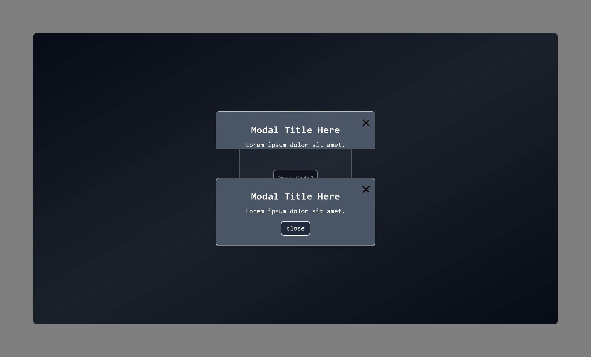
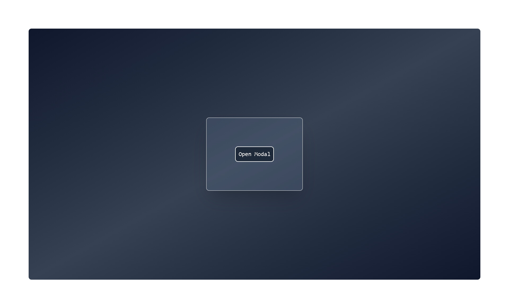

# 🖼️ Modal Dialog Box (React + TailwindCSS)

A simple and reusable **Modal Dialog Box** built with **React** and **TailwindCSS**.  
This modal includes an overlay, open/close functionality, and is fully responsive.

---

## 📌 Features

- ✅ Responsive & centered modal
- ✅ Background overlay with click-to-close
- ✅ Close button (❌) inside modal
- ✅ Easy integration into any React project
- ✅ Built using **React Hooks (`useState`)**

---

## 📸 Screenshot

>  > 

---

## 🚀 Getting Started

# 📂 Project Structure

modal-dialog-box/
│── src/
│ ├── Modal.js
│ ├── App.js
│ └── index.js
│── package.json
│── README.md

---
